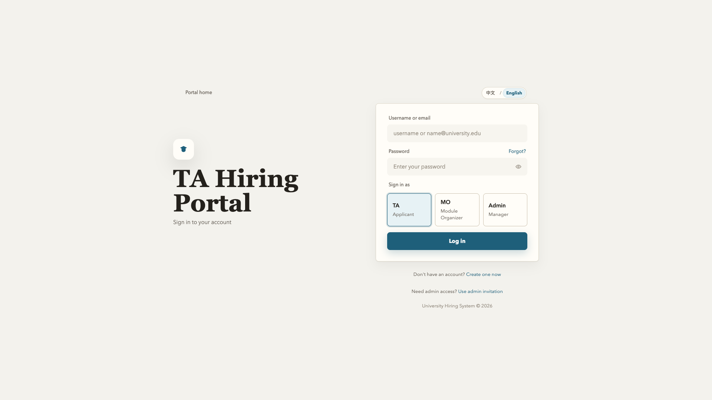
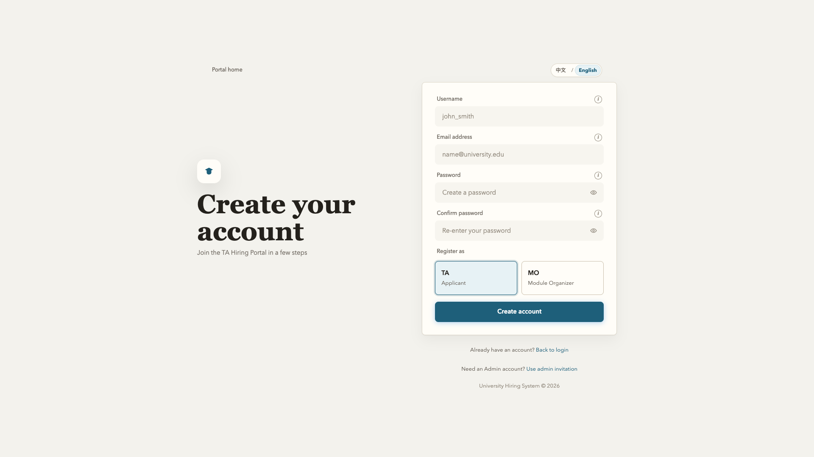
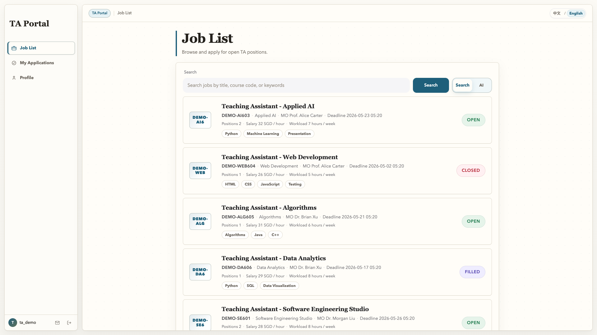
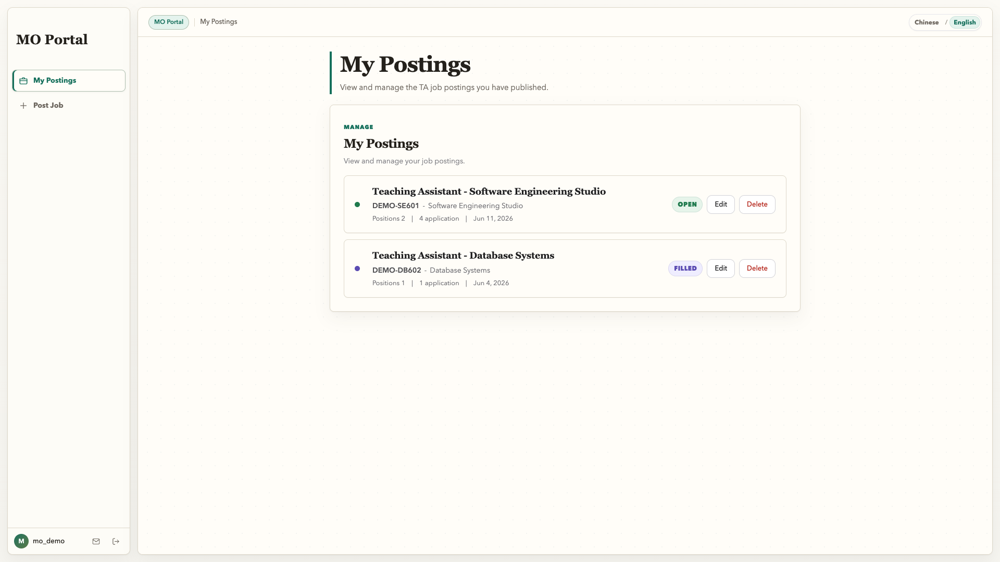
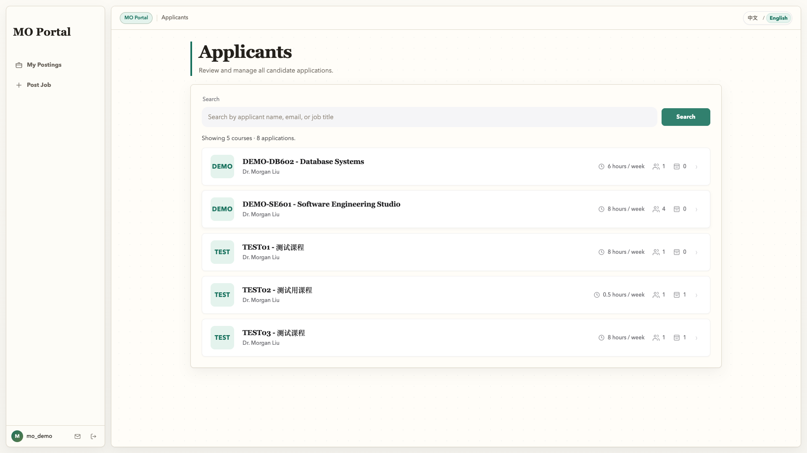
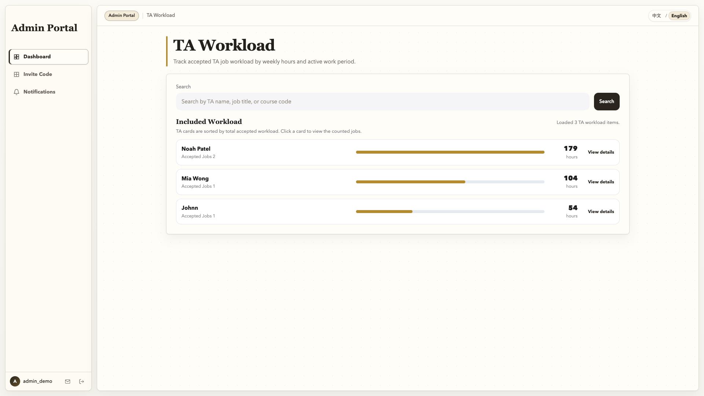

# TA Hiring System 软件工程系统用户手册

## 1. 文档概述

本手册用于帮助 TA、MO 和管理员用户完成系统中的常见业务操作，包括：

- 账号注册与登录
- 个人资料管理与简历上传
- 岗位发布与申请审核
- 查看 AI 能力分析结果（技能匹配 / 缺失技能）
- 管理端统计与数据导出

---

## 2. 系统访问

- 默认入口：`http://localhost:8080/groupproject/`
- 登录页面：`/login.jsp`
- 注册页面：`/register.jsp`

如果端口已经被修改，请使用本地 Tomcat 环境中配置的实际端口。

### 2.2 登录页面

### 2.3 注册页面

### 2.4 开发演示账号

为了开发和演示，系统提供以下固定账号：

| 角色 | 用户名 | 密码 |
| ---- | ------ | ---- |
| TA | `ta_demo` | `Pass1234` |
| MO | `mo_demo` | `Pass1234` |
| 管理员 | `admin_demo` | `Pass1234` |

如果本地用户 CSV 文件中缺少这些账号，后端会在应用启动时自动重新创建。

---

## 3. 角色与权限

### 3.1 TA（申请人）

- 创建或更新个人资料
- 上传简历
- 浏览岗位并提交申请
- 查看申请状态

### 3.2 MO（模块负责人）

- 发布并维护岗位信息
- 查看申请人列表
- 接受或拒绝申请
- 查看缺失技能可视化分析结果

### 3.3 管理员

- 查看全局工作量统计
- 查看各 MO 的处理负载
- 按时间范围筛选并导出 CSV 数据

---

## 4. 首次使用流程

1. 打开注册页面，选择合适的角色并创建账号。
2. 登录后，系统会根据用户角色进入对应的仪表盘。
3. TA 用户应先完善个人资料和技能信息，再申请岗位。
4. MO 用户应先发布岗位，再在申请管理页面审核候选人。
5. 管理员用户可以进入统计界面查看系统工作量数据。

---

## 5. TA 用户指南

### 5.0 TA 仪表盘

### 5.1 创建个人资料

在 TA 页面中填写：

- 姓名、学号、院系和项目类型（本科 / 硕士 / 博士）
- 技能列表（建议使用逗号分隔）
- GPA、电话号码、地址、经历和申请动机

### 5.2 上传简历

- 支持格式：PDF、DOC、DOCX
- 最大文件大小：10MB
- 上传后，系统会保存相对文件路径，供后续审核使用

### 5.3 申请岗位

在岗位列表页面中选择岗位，填写求职说明后提交申请。

### 5.4 岗位列表

提交后，可以在申请状态页面查看以下状态：

- `PENDING` 待审核
- `ACCEPTED` 已接受
- `REJECTED` 已拒绝
- `WITHDRAWN` 已撤回

### 5.5 申请状态

---

## 6. MO 用户指南

### 6.0 MO 仪表盘

### 6.1 发布岗位

必须提供以下岗位基本信息：

- 岗位标题、课程代码和课程名称
- 岗位描述、所需技能、招聘人数、工作量、薪资和截止日期

### 6.2 审核申请

在申请审核页面中，可以：

- 查看申请人信息和求职说明
- 接受或拒绝 `PENDING` 状态的申请

### 6.3 申请人筛选

### 6.4 缺失技能分析

通过缺失技能界面，可以查看：

- 单个申请人的匹配结果和缺失项
- 缺失技能的汇总频次
- 推荐的提升建议

### 6.5 AI 技能匹配

---

## 7. 管理员用户指南

### 7.0 管理员仪表盘

### 7.1 总申请统计

统计界面可以返回申请状态的全局分布：

- 申请总数
- 待审核数量
- 已接受数量
- 已拒绝数量
- 已撤回数量

### 7.2 MO 工作量统计

可以按 MO 查看以下信息：

- 总处理量
- 待审核数量
- 已处理数量
- 已接受 / 已拒绝 / 已撤回申请的分布

### 7.3 时间范围筛选与导出

界面支持使用 `start/end` 参数进行时间筛选。  
设置 `export=csv` 后，可以下载统计数据，用于外部报告和分析。

---

## 8. 常见问题

### 8.1 登录失败

- 检查用户名 / 邮箱和密码是否正确
- 检查所选登录角色是否与账号角色一致

### 8.2 无法上传简历

- 检查文件格式是否为 PDF/DOC/DOCX
- 检查文件大小是否超过 10MB

### 8.3 统计数据不可见

- 确认当前账号拥有所需权限（管理员或 MO）
- 确认会话没有过期；如已过期，请重新登录

---

## 9. 维护建议

- 每次迭代后，更新本手册中的页面路径和接口说明
- 新增权限控制或字段校验后，更新“角色与权限”和“常见问题”部分

---

## 10. 截图要求汇总

以下是本用户手册需要的全部截图：

| 章节 | 文件名 | 说明 |
| ---- | ------ | ---- |
| 2.2 | `login.png` | 包含用户名 / 密码字段和角色选择器的登录页面 |
| 2.3 | `register.png` | 包含角色选择和注册表单的注册页面 |
| 5.0 | `ta-dashboard.png` | 包含个人资料摘要和快捷操作的 TA 仪表盘 |
| 5.4 | `ta-job-list.png` | 显示可申请岗位的 TA 岗位列表页面 |
| 5.5 | `ta-application-status.png` | 显示全部申请记录的 TA 申请状态页面 |
| 6.0 | `mo-dashboard.png` | 包含岗位统计和待处理申请的 MO 仪表盘 |
| 6.3 | `mo-applicant-selection.png` | 包含接受 / 拒绝按钮的 MO 申请审核页面 |
| 6.5 | `mo-ai-skill-match.png` | MO AI 技能匹配分析页面 |
| 7.0 | `admin-dashboard.png` | 包含系统统计和 TA 工作量图表的管理员仪表盘 |

**注意**：所有截图都应放在相对于本 Markdown 文件的 `user-manual-images/` 目录中，并使用上表指定的文件名。建议截图尺寸为 1920x1080 或相近比例，展示完整界面并去除浏览器边框。
